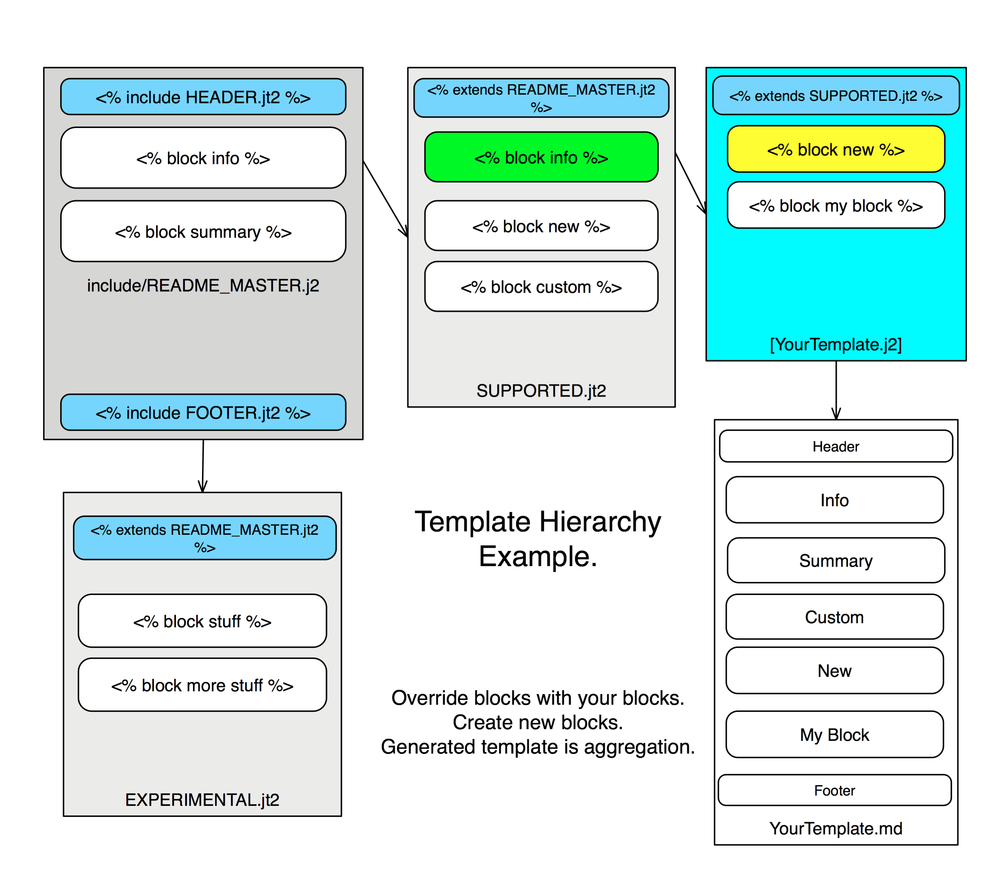

# Template, Image and Data organization

We are still working on the proper classification and definition of the master templates.  Once that is done we will
publish a clear taxonomy.  For now, take this project as an example and proof of technology.

# Templates

Relative to the 
- `build/` contains the scripts and systems to build the documentation. 
- `build/include/` contains the master template files.  These are included or inherited by the other templates.  They 
contain the basic layout and structure of each different type of templates and are top down hierarchical. 
- `build/src/` organized in the same 
directory structure as you wish the generated content to be. 
- `build/target/` contains the generated content after you run `make package` as described in the [WRITERS.md](WRITERS.md)

# Hierarchy

The template structure starts with the master templates in the `include` directory. These do not get compiled directly, 
but act as the 'parents' of the templates you write.  They have the common elements and contain the overall structure we 
follow for all our templates.  The template you write will be just 'what is different' as an override block of the standard
or as a new block.  To 'zero' out a portion of the master template you inherit from you include a block named the same 
contains no text.  Otherwise any block your parents have will appear in your template.

# Data

The data is also hiearchical, with lower level data overriding previous data.  See the example below, where the title
is overriden for the specific template.

# Images

Images should be placed in src in the correct location, 
they will be copied over to the target if they exist.

