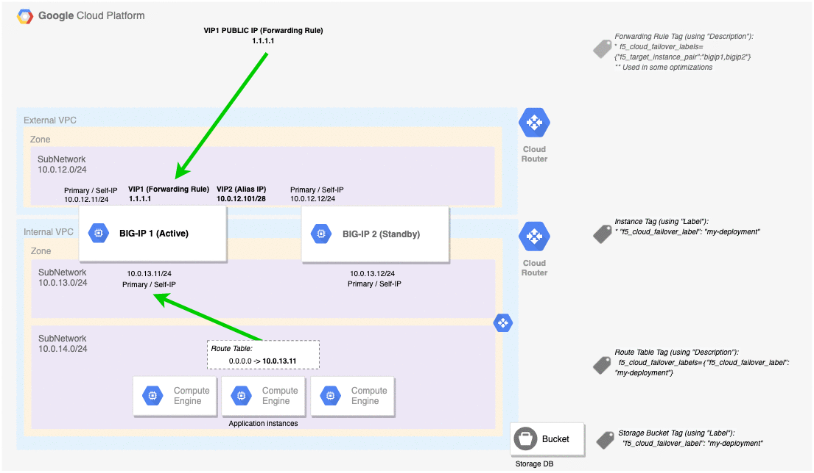

# Deploying the BIG-IP VE in Google Cloud - HA Cluster (Active/Standby): Existing Stack with BYOL Licensing

<!--- file autogenerated --->

[](https://f5cloudsolutions.herokuapp.com)
[](https://github.com/f5networks/f5-google-gdm-templates/releases)
[](https://github.com/f5networks/f5-google-gdm-templates/issues)


## Contents

- [Introduction](#introduction)
- [Prerequisites](#prerequisites)
- [Important Configuration Notes](#important-configuration-notes)
- [Security](#security)
- [Deploying the Template](#deploying-the-template)
- [Help](#help)
- [Service Discovery](#service-discovery)
- [Configuration Example](#config)


## Introduction

This solution uses a Google Deployment Manager (GDM) Template to launch two BIG-IP VEs in an Active/Standby configuration with network failover enabled (the template also supports [multiple traffic groups](#traffic-group-configuration) which enables Active/Active deployments) in a Google Virtual Private Cloud, using BYOL (bring your own license) (utility) licensing.
Traffic flows from the BIG-IP VE(s) to the application servers. Each BIG-IP VE has 3 network interfaces (NICs), one for management, one for external traffic, and one for internal traffic.
 **Networking Stack Type:** This template deploys into an existing networking stack; so the networking infrastructure MUST be available prior to deploying. See the [Template Parameters Section](#template-parameters) for required networking objects.

## Prerequisites

The following are prerequisites for the F5 failover-api 3 NIC GDM template:

- An F5 Networks BYOL license (Bring Your Own License) available.
- You must have installed the [Google Cloud SDK](https://cloud.google.com/sdk/downloads)
- Key pair for SSH access to BIG-IP VE (you can create or import this in Google Cloud)
- Three Virtual Private Cloud (VPC) networks with at least one subnet in each. The subnet for the management network requires a route and access to the Internet for the initial configuration to download the BIG-IP cloud library.
- A Google Firewall rule with the following inbound rules:
    - Port 22 for SSH access to the BIG-IP VE
    - Port 443 (or alternate port) for accessing the BIG-IP web-based Configuration utility
    - A port for accessing your applications via the BIG-IP virtual server
- This solution uses the SSH key to enable access to the BIG-IP system. If you want access to the BIG-IP web-based Configuration utility, you must first SSH into the BIG-IP VE (using an SSH key provided via project-wide metadata).  You can then create a user account with admin-level permissions on the BIG-IP VE to allow access if necessary.
- This solution requires read/write access to Google Compute Engine and Google Cloud Storage.
- **Important**: For this 3 NIC template, you MUST use a machine type of at least **n1-standard-4**.  See this [link](https://cloud.google.com/vpc/docs/create-use-multiple-interfaces#max-interfaces) for more information about required vCPUs and interfaces.  Note: Because of this requirement, the *n1-highcpu* instance types are not supported.
- You must use a BIG-IP instance that has at least 4 vCPU and 8 GB memory. For each additional vCPU, add at least 2 GB of memory.


## Important configuration notes

- All F5 Google templates include Application Services 3 Extension (AS3) v3.5.1 (LTS version) on the BIG-IP VE.  As of release 4.1.2, all supported templates give the option of including the URL of an AS3 declaration, which you can use to specify the BIG-IP configuration you want on your newly created BIG-IP VE(s).  In templates such as autoscale, where an F5-recommended configuration is deployed by default, specifying an AS3 declaration URL will override the default configuration with your declaration.   See the [AS3 documentation](https://clouddocs.f5.com/products/extensions/f5-appsvcs-extension/3.5.1/) for details on how to use AS3.
- This template supports service discovery.  See the [Service Discovery section](#service-discovery) for details.
- F5 has created a matrix that contains all of the tagged releases of the F5 Google GDM templates, and the corresponding BIG-IP versions, license types and throughput levels available for a specific tagged release. See the matrix [here](https://github.com/F5Networks/f5-google-gdm-templates/blob/master/google-bigip-version-matrix.md).
- If you would like to view all available images, run the following command from the **gcloud** command line: ```$ gcloud compute images list --project f5-7626-networks-public | grep f5```
- This directory now contains a schema file which helps manage the required fields and set defaults to optional fields.  For example, if you omit the property for NTP servers in your configuration file,  we set the default server to time.google.com.
- Note that when configuring GCP failover, if no external public IPs are provisioned, a GCP alias IP range is required.
- **Important**: This solution configures the second interface of the instance as the MGMT interface.  This allows the first interface to be used by Google Cloud resources such as forwarding rules and load balancers for application traffic.  To connect to the MGMT interface (nic1) get the IP address from the instance properties and use your management tool of choice.  Note: The Google Cloud console and gcloud SSH connection options target nic0 and will not connect to the instance correctly.
- In order to pass traffic from your clients to the servers, after launching the template, you must create virtual server(s) on the BIG-IP VE.  See [Creating a virtual server](#creating-virtual-servers-on-the-big-ip-ve).
- This template creates target instances for each BIG-IP VE as well as a user specified number of forwarding rules.  For more information on creating or modifying these rules see the google [documentation](https://cloud.google.com/load-balancing/docs/forwarding-rules).
- This template supports associating IP's with up to two BIG-IP traffic groups, allowing each BIG-IP VE device to process traffic for applications associated with the traffic group for which the device is active.  See [Traffic Group Configuration](#traffic-group-configuration) for instructions.
- Note: If you are unable to delete the GDM deployment with an error similar to ```The target_instance resource <resource> is already being used by forwarding rule <resource git>```, try again to delete the deployment.  If it continues to fail delete any forwarding rules created by the deployment and try again.

### Security

This GDM template downloads helper code to configure the BIG-IP system. If you want to verify the integrity of the template, you can open the GDM template and ensure the following lines are present. See [Security Detail](#securitydetail) for the exact code in each of the following sections.

- In the */config/verifyHash* section: **script-signature** and then a hashed signature


Additionally, F5 provides checksums for all of our supported Google Deployment Manager templates. For instructions and the checksums to compare against, see this [link](https://devcentral.f5.com/codeshare/checksums-for-f5-supported-cft-and-arm-templates-on-github-1014).


### Help

**F5 Support** <br>
Because this template has been created and fully tested by F5 Networks, it is fully supported by F5. This means you can get assistance if necessary from [F5 Technical Support](https://support.f5.com/csp/article/K44842449). You can modify the template itself if necessary, but if you modify any of the code outside of the lines ### START CUSTOM TMSH CONFIGURATION and ### END CUSTOM TMSH CONFIGURATION the template is no longer supported by F5.

**Community Support** <br>
We encourage you to use our [Slack channel](https://f5cloudsolutions.herokuapp.com) for discussion and assistance on F5 Google GDM templates. There are F5 employees who are members of this community who typically monitor the channel Monday-Friday 9-5 PST and will offer best-effort assistance. This slack channel community support should **not** be considered a substitute for F5 Technical Support. See the [Slack Channel Statement](https://github.com/F5Networks/f5-google-gdm-templates/blob/master/slack-channel-statement.md) for guidelines on using this channel.

## Deploying the template

This solution uses python script and a YAML file to deploy the BIG-IP VE.  The YAML file contains the parameters necessary to deploy the BIG-IP instance in Google Cloud, and calls the python script to launch the instance.

- BYOL: [**f5-existing-stack-same-net-cluster-byol-3nic-bigip.yaml**](f5-existing-stack-same-net-cluster-byol-3nic-bigip.yaml)


You ***must edit the YAML file*** to include information for your deployment before using the file to launch the BIG-IP VE instance.

1. Make sure you have completed all of the [prerequisites](#prerequisites).
2. [Edit the parameters](#edit-the-yaml-file) in the YAML file in this repository as described in this section.
3. [Save the YAML and Python files](#save-the-yaml-and-python-files).
4. [Deploy the BIG-IP VE](#deploy-the-big-ip-ve) from the command line.


### Edit the YAML file

After completing the prerequisites, edit the YAML file.  You must replace the following parameters with the appropriate values.

| Parameter | Required | Description |
| --- | --- | --- |
| region | Yes | Enter the Google Region in which you want to deploy BIG-IP, for example 'us-west1'. |
| availabilityZone1 | Yes | Enter the availability zone where you want to deploy the BIG-IP VE instance, for example 'us-west1-a'. |
| mgmtNetwork | Yes | Specify the name of the network to use for management traffic, for example 'my-management-network'. |
| mgmtSubnet | Yes | Specify the name of the subnet to use for management traffic, for example 'my-management-subnetwork'. |
| restrictedSrcAddress | Yes | This field restricts management access to a specific network or address. Enter an IP address or address range in CIDR notation separated by a space, or '0.0.0.0/0' for all sources. For example, '10.0.0.0/0'. |
| network1 | Yes | Specify the Network name for BIG-IP application traffic, for example 'my-application-network'. |
| subnet1 | Yes | Specify the subnet of the Network that the BIG-IP should use for application traffic, for example 'my-application-subnetwork'. |
| network2 | Yes | Specify the Network name for BIG-IP internal application traffic, for example 'my-internal-network'. |
| subnet2 | Yes | Specify the name of the Subnet of the Network that BIG-IP should use for internal application traffic, for example 'my-internal-subnetwork'. |
| licenseKey1 | Yes | Enter the BIG-IP license key, for example 'CTASW-GVZHE-FYVIM-XMOUP-SJSTBXX'. |
| licenseKey2 | Yes | Enter the second BIG-IP license key. |
| aliasIp | No | Enter the alias IP address(es) to be used for application traffic, including CIDR suffix. This address must belong to the subnet noted above in key 'subnet1'. A list of alias IPs can be provided, separated by a space. For example, 'IE 10.x.x.16/28 10.x.x.32/28'. |
| numberOfForwardingRules | No | Enter the number of forwarding rules to create, for example '1'.  All integers from 1 to the max quota for the forwarding rules resource type are allowed. |
| provisionPublicIP | Yes | Provision Public IP addresses for BIG-IP Network Interfaces. By default it is set to provision public IPs. |
| imageName | Yes | BIG-IP image name |
| instanceType | Yes | Instance type assigned to BIG-IP, for example 'n1-standard-4'. |
| mgmtGuiPort | No | (Optional) Enter the BIG-IP Management Port, the default is '443'. |
| ntpServer | No | (Optional) List NTP servers separated by a space, for example 'pool.ntp.org'. The default is 'time.google.com'. |
| timezone | No | (Optional) Enter the Olson timezone string from /usr/share/zoneinfo. The default is 'UTC'. See the TZ column here (https://en.wikipedia.org/wiki/List_of_tz_database_time_zones) for legal values. For example, 'US/Eastern'. |
| bigIpModules | No | Enter a comma-separated list of modules and provisioning level, for example 'ltm:nominal' or 'ltm:nominal,asm:nominal'. |
| serviceAccount | Yes | Enter the Google service account to use for autoscale API calls, for example 'username@projectname.iam.serviceaccount.com'. |
| allowUsageAnalytics | Yes | This deployment can send anonymous statistics to F5 to help us determine how to improve our solutions. If you enter **no** statistics are not sent. |
| logLevel | No | (Optional) Log setting, used to set log level on scripts used during deployment. Acceptable values are - error, warn, info, verbose, debug, silly. The default is 'info'. |
| declarationUrl | Yes | URL for the AS3 declaration JSON file to be deployed. If left at **default**, the recommended F5 WAF configuration will be applied. Enter **none** to deploy without a service configuration. For example, ' https://cdn.f5.com/product/cloudsolutions/declarations/sample_01.json ' |


### Save the YAML and Python files

After you have edited the YAML file with the appropriate values, save the YAML file in a location accessible from the gcloud command line.  Save the [python file](f5-existing-stack-same-net-cluster-byol-3nic-bigip.py) in the same location.

### Deploy the BIG-IP VE

The final task is to deploy the BIG-IP VE from the **gcloud** command line.  See https://cloud.google.com/sdk/gcloud/reference/deployment-manager/deployments/create for specific information.

You can either create a new deployment from the [top-level YAML file](#deploying-from-the-yaml-file), or the [top-level template file](#deploying-from-the-template-file).

#### Deploying from the YAML file
To deploy the BIG-IP VE from the top-level YAML file, use the following command syntax:

```gcloud deployment-manager deployments create <your-deployment-name> --config <your-file-name.yaml> --description "<deployment-description>"```

Keep in mind the following:

- *your-deployment-name*<br>This name must be unique.<br>
- *your-file-name.yaml*<br>  If your file is not in the same directory as the Google SDK, include the full file path in the command.


#### Deploying from the template file
To deploy the BIG-IP VE from the top-level template file, use the following syntax, and set each property key you are using:

```
gcloud deployment-manager deployments create <your-deployment-name>       \
      --template template.{jinja|py}                                      \
      --properties "string-key:'string-value',integer-key:12345"
```

## Configuration Example <a name="config"></a>

The following is a simple configuration diagram for this deployment.



## Creating virtual servers on the BIG-IP VE

In order to pass traffic from your clients to the servers through the BIG-IP system, you must create a virtual server on the BIG-IP VE. To create a BIG-IP virtual server you need to know the IP address to use, which should match (or be within the CIDR range defined) of either a 1) GCP alias IP or a 2) GCP forwarding rule IP configured on the active BIG-IP VE instance. If you need additional virtual servers for your applications/servers, you can add more GCP resources, and corresponding virtual servers on the BIG-IP system. See [gcp-vpc-alias-ips](https://cloud.google.com/vpc/docs/alias-ip) for information on alias IP ranges. See [gcp-forwarding-rules](https://cloud.google.com/load-balancing/docs/forwarding-rules) for more information on forwarding rules.

In this template, each IP address is associated with a GCP object attached to the external network interface of the BIG-IP VE. Because this IP will be moved to the active BIG-IP device, you need to create a single virtual server in **traffic-group-1** that corresponds to the IP address of that object.
1. Once your BIG-IP VE has launched, open the BIG-IP VE Configuration utility.
2. On the Main tab, click **Local Traffic > Virtual Servers** and then click the **Create** button.
3. In the **Name** field, give the Virtual Server a unique name.
4. In the **Destination/Mask** field, type the IP address of the object to be associated with your application (for example: 10.0.1.10/32 or 80.80.80.80/32).
5. In the **Service Port** field, type the appropriate port.
6. Configure the rest of the virtual server as appropriate.
7. Click the **Finished** button.
8. Repeat as necessary.

When you have completed the virtual server configuration, you may modify the virtual addresses to use an alternative Traffic Group using the following guidance.
1. On the Main tab, click **Local Traffic > Virtual Servers**.
2. On the Menu bar, click the **Virtual Address List** tab.
3. Click the address of one of the virtual servers you just created.
4. From the **Traffic Group** list, select **traffic-group-2** (or the additional traffic group you created previously).
5. Click **Update**.
6. Repeat for each virtual server.

### Traffic Group Configuration

This template supports associating GCP resources with up to two BIG-IP traffic groups, allowing each BIG-IP VE device to process traffic for applications associated with the traffic group for which the device is active.  Use the following guidance to configure multiple traffic groups.

1. From the BIG-IP VE management Configuration utility, click **Device Management > Traffic Groups > Create**, and then complete the following.
- *Name*: **traffic-group-2**
- *Failover Order*: Select the preferred order of the devices for this traffic group; F5 recommends setting the current standby device as the preferred device for this second traffic group, so that each traffic group has a different preferred device (device will become active after creating the traffic group).
- Click **Create Traffic Group**.
2. Ensure the BIG-IP **Virtual Address** corresponding with the created virtual servers is in the desired traffic group.
- Note: GCP resources are mapped to a specific traffic group by the Virtual Address configuration of the BIG-IP.
- Note: You can find the Virtual Address list by browsing to Local Traffic->Virtual Servers->Virtual Address List.

## Service Discovery

This Google GDM template includes the Service Discovery iApp. See our [Service Discovery video](https://www.youtube.com/watch?v=ig_pQ_tqvsI) to see how to configure the Service Discovery iApp, and see this feature in action.

### Tagging

In Google, you tag objects using the **labels** parameter within the virtual machine.  The Service Discovery iApp uses these tags to discover nodes with this tag. Note that you select public or private IP addresses within the iApp.

- *Tag a VM resource*

The BIG-IP VE will discover the primary public or private IP addresses for the primary NIC configured for the tagged VM.

**Important**: Make sure the tags and IP addresses you use are unique. You should not tag multiple GDM nodes with the same key/tag combination if those nodes use the same IP address.

If you want to verify the integrity of the template, from the BIG-IP VE Configuration utility click **iApps > Templates**. In the template list, look for **f5.service_discovery**. In the Verification column, you should see **F5 Verified**.

### Documentation
The ***BIG-IP Virtual Edition and Google Cloud Platform: Setup*** [guide](https://support.f5.com/kb/en-us/products/big-ip_ltm/manuals/product/bigip-ve-setup-google-cloud-platform-13-0-0.html) details how to create the configuration manually without using the template.  This document also describes the configuration in more detail.


## Security Details <a name="securitydetail"></a>

This section has the entire code snippet for each of the lines you should ensure are present in your template file if you want to verify the integrity of the helper code in the template.

### /config/verifyHash section

Note the hashes and script-signature may be different in your template. The important thing to check is that there is a script-signature line present in the location.<br>


```python

  'cli script /Common/verifyHash {',
        'proc script::run {} {',
        '        if {[catch {',
        '            set hashes(f5-cloud-libs.tar.gz) a1de46685e31463e6c103078797b90e5f29a4b94702b0522eef2364c3792414067a0bea50c4ed49784c14277a578d8b41f9ac7ba058d9ff72ef687034e5119c6',
        '            set hashes(f5-cloud-libs-aws.tar.gz) d0803e306c01bdf82895c8f30f3b3c2df5f76edbe1875c0ffbfea6864436ece54a73ffd02ccd1b889c324b093897702087b722f10cc7f87994f518f81d7260ea',
        '            set hashes(f5-cloud-libs-azure.tar.gz) a1f264a165b88c03f55d49afb4fdb5f63d80755f1afe947a02e4a36755c7fcec432495417d8084329c6c14e4c426c2e63bab92862afb760d63f584a570b119e6',
        '            set hashes(f5-cloud-libs-gce.tar.gz) c01b25f4d6f48d9ac21b1a6ba3553c978e4fb8ce8655947a307f27e67833c4bebf8b72fef108ea02e11b5e9aa35d33e39db8624b3db34de509d0d79959c754c7',
        '            set hashes(f5-cloud-libs-openstack.tar.gz) 5c83fe6a93a6fceb5a2e8437b5ed8cc9faf4c1621bfc9e6a0779f6c2137b45eab8ae0e7ed745c8cf821b9371245ca29749ca0b7e5663949d77496b8728f4b0f9',
        '            set hashes(asm-policy-linux.tar.gz) 63b5c2a51ca09c43bd89af3773bbab87c71a6e7f6ad9410b229b4e0a1c483d46f1a9fff39d9944041b02ee9260724027414de592e99f4c2475415323e18a72e0',
        '            set hashes(f5.http.v1.2.0rc4.tmpl) 47c19a83ebfc7bd1e9e9c35f3424945ef8694aa437eedd17b6a387788d4db1396fefe445199b497064d76967b0d50238154190ca0bd73941298fc257df4dc034',
        '            set hashes(f5.http.v1.2.0rc6.tmpl) 811b14bffaab5ed0365f0106bb5ce5e4ec22385655ea3ac04de2a39bd9944f51e3714619dae7ca43662c956b5212228858f0592672a2579d4a87769186e2cbfe',
        '            set hashes(f5.http.v1.2.0rc7.tmpl) 21f413342e9a7a281a0f0e1301e745aa86af21a697d2e6fdc21dd279734936631e92f34bf1c2d2504c201f56ccd75c5c13baa2fe7653213689ec3c9e27dff77d',
        '            set hashes(f5.aws_advanced_ha.v1.3.0rc1.tmpl) 9e55149c010c1d395abdae3c3d2cb83ec13d31ed39424695e88680cf3ed5a013d626b326711d3d40ef2df46b72d414b4cb8e4f445ea0738dcbd25c4c843ac39d',
        '            set hashes(f5.aws_advanced_ha.v1.4.0rc1.tmpl) de068455257412a949f1eadccaee8506347e04fd69bfb645001b76f200127668e4a06be2bbb94e10fefc215cfc3665b07945e6d733cbe1a4fa1b88e881590396',
        '            set hashes(f5.aws_advanced_ha.v1.4.0rc2.tmpl) 6ab0bffc426df7d31913f9a474b1a07860435e366b07d77b32064acfb2952c1f207beaed77013a15e44d80d74f3253e7cf9fbbe12a90ec7128de6facd097d68f',
        '            set hashes(f5.aws_advanced_ha.v1.4.0rc3.tmpl) 2f2339b4bc3a23c9cfd42aae2a6de39ba0658366f25985de2ea53410a745f0f18eedc491b20f4a8dba8db48970096e2efdca7b8efffa1a83a78e5aadf218b134',
        '            set hashes(asm-policy.tar.gz) 2d39ec60d006d05d8a1567a1d8aae722419e8b062ad77d6d9a31652971e5e67bc4043d81671ba2a8b12dd229ea46d205144f75374ed4cae58cefa8f9ab6533e6',
        '            set hashes(deploy_waf.sh) 1a3a3c6274ab08a7dc2cb73aedc8d2b2a23cd9e0eb06a2e1534b3632f250f1d897056f219d5b35d3eed1207026e89989f754840fd92969c515ae4d829214fb74',
        '            set hashes(f5.policy_creator.tmpl) 06539e08d115efafe55aa507ecb4e443e83bdb1f5825a9514954ef6ca56d240ed00c7b5d67bd8f67b815ee9dd46451984701d058c89dae2434c89715d375a620',
        '            set hashes(f5.service_discovery.tmpl) 7a4660468dffdc4f6d9aec4c1f9d22abfb3e484e7d6fe6a12fc9ab3eec3819dc34d133aea3cce4fdd87a0f4045069270061f2ea1ee7735922e4371592e498a0b',
        '            set hashes(f5.cloud_logger.v1.0.0.tmpl) a26d5c470e70b821621476bcfd0579dbc0964f6a54158bc6314fa1e2f63b23bf3f3eb43ade5081131c24e08579db2e1e574beb3f8d9789d28acb4f312fad8c3e',
        'NEW_LINE',
        '            set file_path [lindex $tmsh::argv 1]',
        '            set file_name [file tail $file_path]',
        'NEW_LINE',
        '            if {![info exists hashes($file_name)]} {',
        '                tmsh::log err "No hash found for $file_name"',
        '                exit 1',
        '            }',
        'NEW_LINE',
        '            set expected_hash $hashes($file_name)',
        '            set computed_hash [lindex [exec /usr/bin/openssl dgst -r -sha512 $file_path] 0]',
        '            if { $expected_hash eq $computed_hash } {',
        '                exit 0',
        '            }',
        '            tmsh::log err "Hash does not match for $file_path"',
        '            exit 1',
        '        }]} {',
        '            tmsh::log err {Unexpected error in verifyHash}',
        '            exit 1',
        '        }',
        '    }',
        '    script-signature jJpTQ0bcHm9SypZSOPeKaHoUKRdTyLbz80xHYXy39dWx76geCGT5otZi4SdqGBiiwKFydQTqSVu+Uzj8TQZGg2fbxKg/Ks28Ht+nvLoTiNwZGY5o+iPse45QvltBvE+aCOIaw8a5ZBd5ZMF7A8JQpTwttUFRjFgXFu9CncAWOTypov46ve9dzRW8dRPbAImaJSby38jUIVWjv2iB3qZHz//bXjdZ5qUpFvpPH5dGzYN5SoQmUVI3kbiOpZlRJcSj8cKzQ7EsQozile5JkzPrzUeeMgOHihAZcOzgvYWl2LYe9iedixzF7ci6d4YNUuUhFfyrlrUOZSMUPtRzM3+rYQ==',
        '    signing-key /Common/f5-irule',

```

## Filing Issues

If you find an issue, we would love to hear about it.
You have a choice when it comes to filing issues:

- Use the **Issues** link on the GitHub menu bar in this repository for items such as enhancement or feature requests and non-urgent bug fixes. Tell us as much as you can about what you found and how you found it.
- Contact us at [solutionsfeedback@f5.com](mailto:solutionsfeedback@f5.com?subject=GitHub%20Feedback) for general feedback or enhancement requests.
- Use our [Slack channel](https://f5cloudsolutions.herokuapp.com) for discussion and assistance on F5 cloud templates. There are F5 employees who are members of this community who typically monitor the channel Monday-Friday 9-5 PST and will offer best-effort assistance.
- For templates in the **supported** directory, contact F5 Technical support via your typical method for more time sensitive changes and other issues requiring immediate support.


## Copyright

Copyright 2014-2019 F5 Networks Inc.


## License

### Apache V2.0

Licensed under the Apache License, Version 2.0 (the "License"); you may not use
this file except in compliance with the License. You may obtain a copy of the
License at:

http://www.apache.org/licenses/LICENSE-2.0

Unless required by applicable law or agreed to in writing, software
distributed under the License is distributed on an "AS IS" BASIS,
WITHOUT WARRANTIES OR CONDITIONS OF ANY KIND, either express or implied.
See the License for the specific language governing permissions and limitations
under the License.


### Contributor License Agreement

Individuals or business entities who contribute to this project must have
completed and submitted the `F5 Contributor License Agreement`